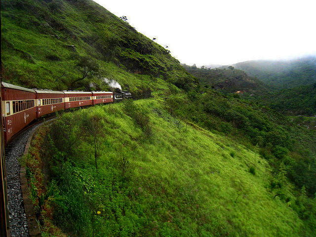
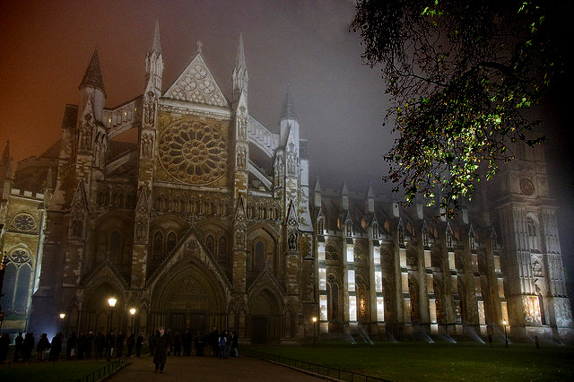

## Learning a Patch Quality Comparator for Single Image Dehazing

#### Sanchayan Santra, Ranjan Mondal, Bhabatosh Chanda

   

   
   

   

   
   

   
   

   
   

   

   
   

<b>Abstract</b>

 In bad weather conditions like fog and haze, the particles present in the atmosphere scatter incident light in different directions. As a result, image taken under these conditions suffers from reduced visibility, lack of contrast, as a result, it appears colorless. Image dehazing method tries to recover a haze-free portrayal of the given hazy image. In this paper we propose a method that dehazes a given image by comparing various output patches with the original hazy version and choosing the best one. The comparison is performed by our proposed dehazed patch quality comparator based on Convolutional Neural Network (CNN). To select the best dehazed patch we employ binary search. Quantitative and qualitative evaluations show that our method achieves good results in most of the cases, and are, on an average, comparable with state-of-the-art methods. 

Accepted in [IEEE Transactions on Image Processing](https://ieeexplore.ieee.org/document/8367892/)  
Preprint paper: [pdf](comp_tip.pdf)  
Code: [Coming Soon](#)

**Results:** [Supplementary Pdf](supp.pdf)
