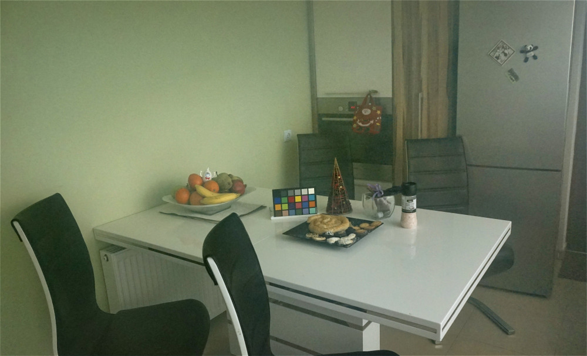
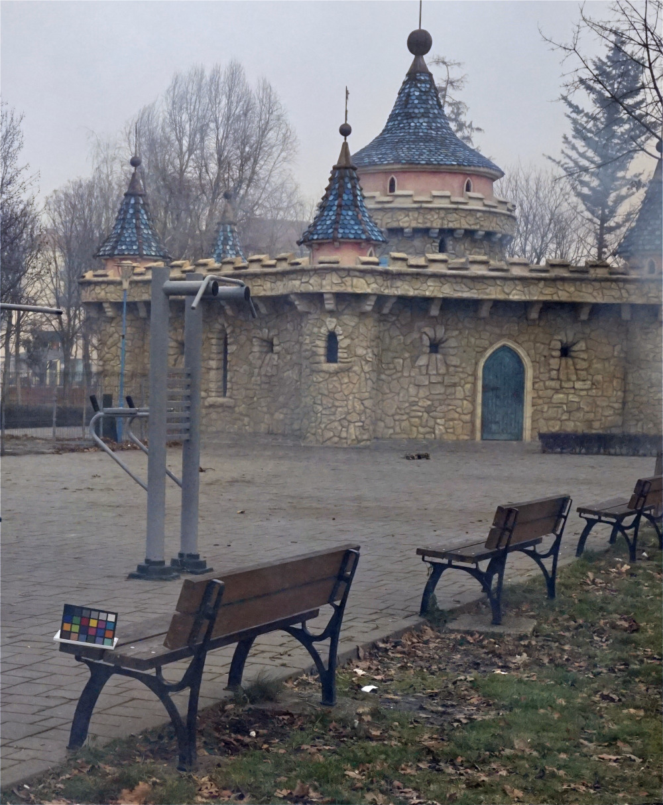

## Image Dehazing by Joint Estimation of Transmittance and Airlight using Bi-Directional Consistency Loss Minimized FCN

#### Ranjan Mondal, Sanchayan Santra, Bhabatosh Chanda

   

   
   

   

   
   

   
   

   
   

   

   
   

<b>Abstract</b>

Very few of the existing image dehazing methods have laid stress on the accurate restoration of color from hazy images, although it is crucial for proper removal of haze. In this paper, we are proposing a Fully Convolutional Neural Network (FCN) based image dehazing method. We have designed a network that jointly estimates scene transmittance and airlight. The network is trained using a custom designed loss, called bi-directional consistency loss, that tries to minimize the error to reconstruct the hazy image from clear image and the clear image from hazy image. Apart from that, to minimize the dependence of the network on the scale of the training data, we have proposed to do both the training and inference in multiple levels. Quantitative and qualitative evaluations show, that the method works comparably with state-of-the-art image dehazing methods.

Published in [CVPR 18 Workshop (NTIRE 2018)](http://openaccess.thecvf.com/content_cvpr_2018_workshops/papers/w13/Mondal_Image_Dehazing_by_CVPR_2018_paper.pdf)  
Preprint paper: [Pdf](ntire18_paper.pdf)  
Poster: [Pdf](ntire18_poster.pdf)  
Presentation Slide: [Pdf](ntire18_slide.pdf)  
Code: [[Github]](https://github.com/san-santra/CVPR2018_Dehazing)

**Results:** [Uploading Soon](#)
