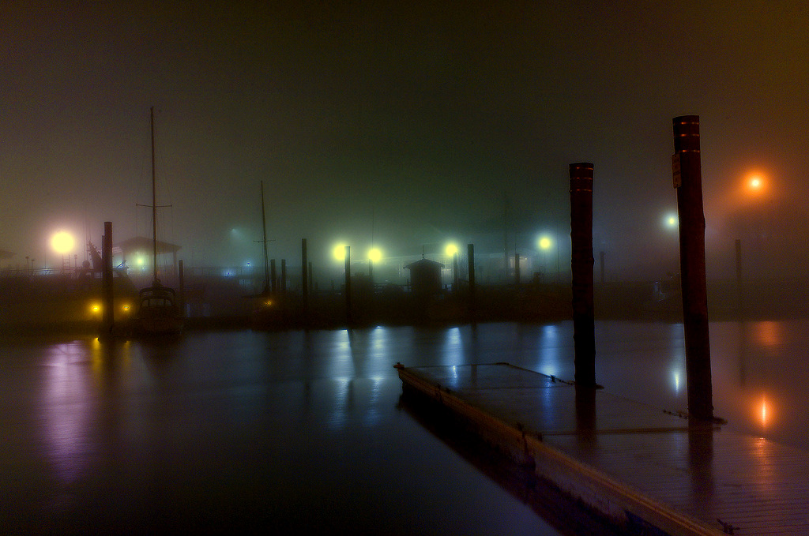

## Day/Night Unconstrained Image Dehazing

   

   
   

   

   
   

   
   

   
   

   

   
   

<b>Abstract</b>

Images taken under fog or haze have their visibility reduced due to the existence of aerosols in the atmosphere. Image dehazing methods try to recover haze-free versions of these images by removing the effect of haze. Methods proposed till now are exclusively for daytime scene images or for night-time scene. The method we propose here can dehaze an image independent of whether it was captured during the day or night. To achieve this we have relaxed the image formation model to take into account spatially varying atmospheric light that may be present in night-time images. We estimate the contributing airlights and also the patches that are affected by it. We then remove the effect of airlight to obtain haze-free image. We demonstrate the results obtained by using our method on day and night-time images. We have compared out results with that of recently reported methods and the results show the effectiveness of our method.

Published in ICPR 2016  
Preprint paper: [[pdf]](santra_dehaze_unconstrained.pdf)  
Presentation slide: [pdf] coming soon

**Results:** [Output Comparison](results.html)

Original images  
<a href="http://commons.wikimedia.org/wiki/File:Oberfallenberg4.JPG">"Oberfallenberg4"</a> by böhringer friedrich. License CC BY-SA 2.5, Wikimedia Commons.  
["fog on the bay"](https://www.flickr.com/photos/dave_decenzo/11479141474/) by David J. DeCenzo

