The image are scaled in the page for viewing.Use 'Right Click -> View Image' to get full size image.

### References
[He et al.](http://kaiminghe.com/cvpr09/index.html)- Single Image Haze Removal using Dark Channel Prior, in TPAMI 2011  
[Fattal](http://www.cs.huji.ac.il/~raananf/projects/dehaze_cl/)- Dehazing using color lines, in ACM ToG 2014  
[Ren et al.](https://sites.google.com/site/renwenqi888/research/dehazing/mscnndehazing)- Single Image Dehazing via Multi-Scale Convolutional Neural Networks, in ECCV 2016  

 

### aerial

Original

Our method
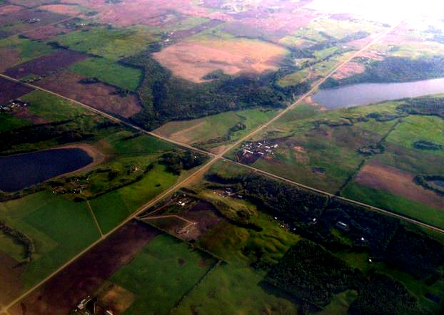

Fattal color line

Ren et al.

### buildings

Original

Our method

Fattal color line

Ren et al.

### canon

Original

Our method
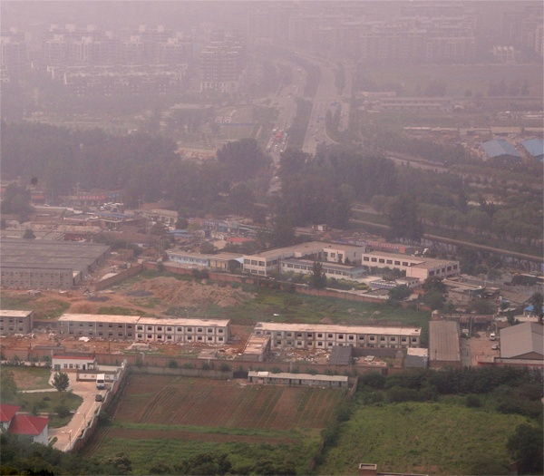

Fattal color line

He et al.

### castle

Original

Our method

Fattal color line

Ren et al.

### cityscape

Original

Our method
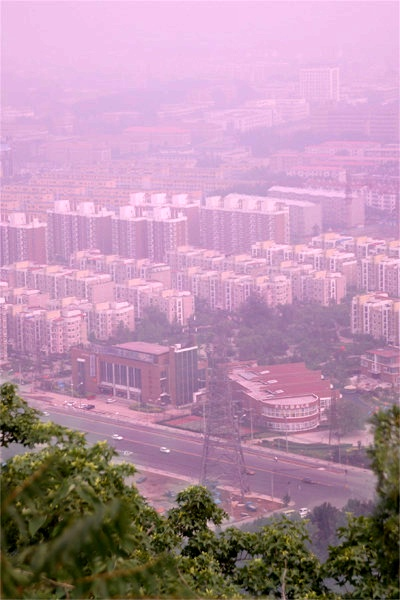

Fattal color line

He et al.

Ren et al.

### cones

Original

Our method
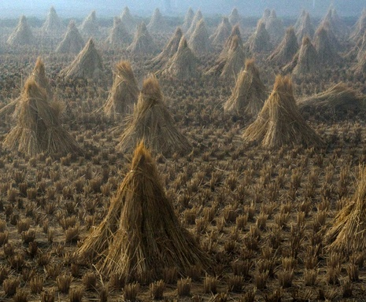

Fattal color line

He et al.

Ren et al.

### dubai

Original

Our method
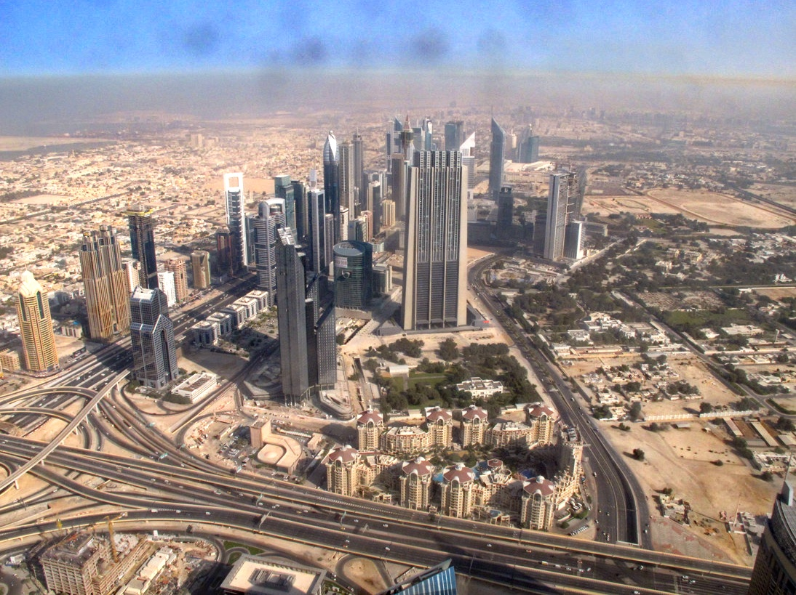

Fattal color line

Ren et al.

### flags

Original

Our method
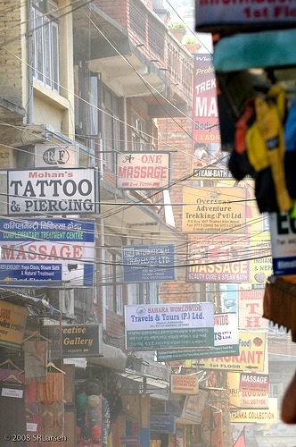

Fattal color line

Ren et al.

### florence

Original

Our method
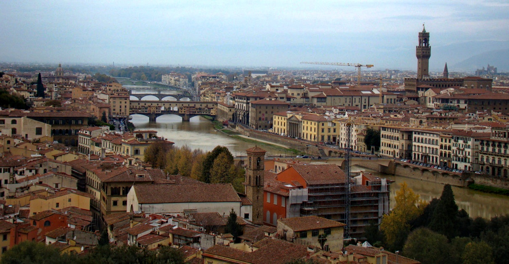

Fattal color line

Ren et al.

### forest

Original

Our method

Fattal color line

He et al.

Ren et al.

### herzeliya

Original

Our method
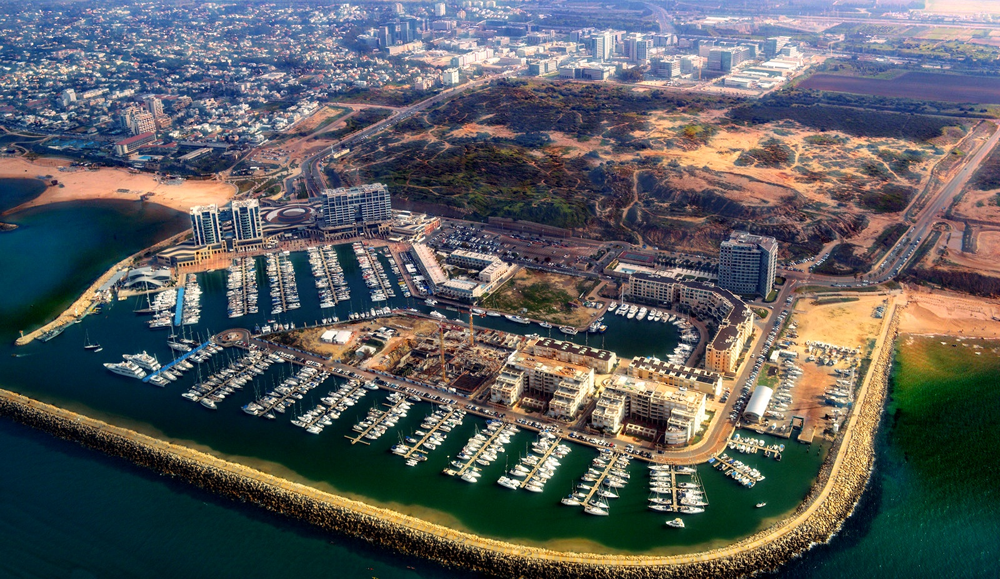

Fattal color line

Ren et al.

### hongkong

Original

Our method

Fattal color line

Ren et al.

### house

Original

Our method

Fattal color line

Ren et al.

### lviv

Original

Our method

Fattal color line

Ren et al.

### mountain

Original

Our method
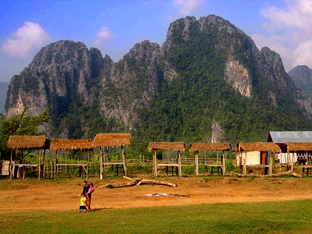

Fattal color line

He et al.

Ren et al.

### newyork

Original

Our method

Fattal color line

Ren et al.

### newyork2

Original

Our method

Ren et al.

### ny12

Original

Our method
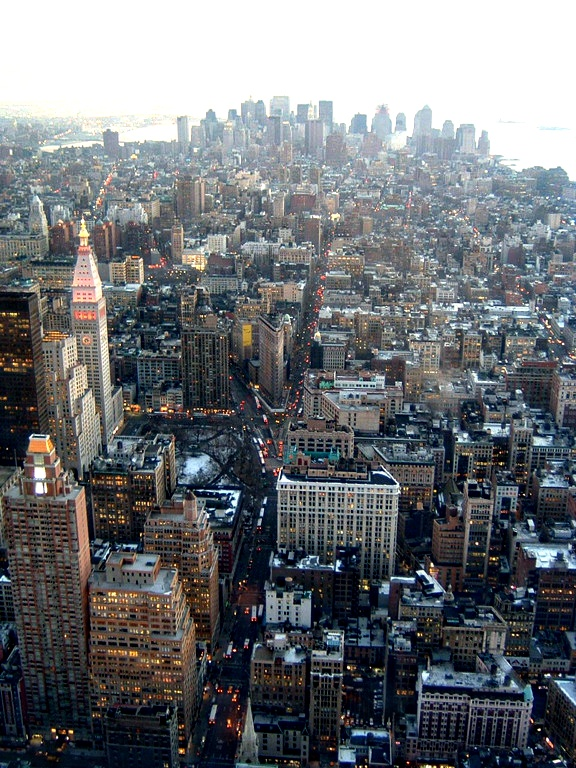

Fattal color line

He et al.

### ny17

Original

Our method
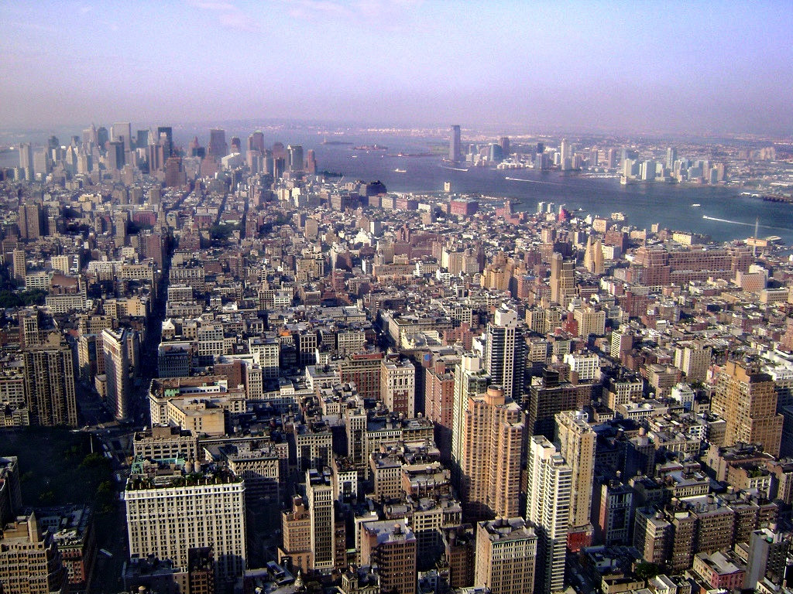

Fattal color line

He et al.

### pumpkins

Original

Our method
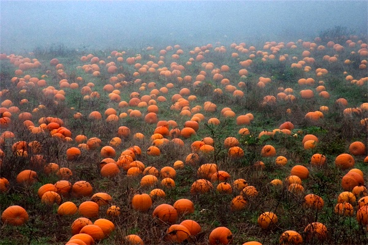

Fattal color line

He et al.

Ren et al.

### snow

Original

Our method

Fattal color line

Ren et al.

### stadium

Original

Our method
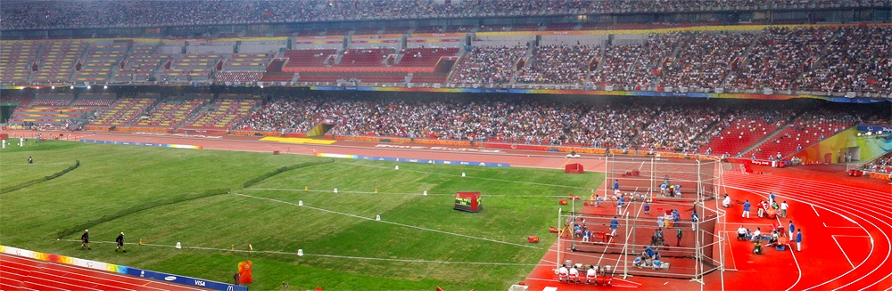

Fattal color line

He et al.

Ren et al.

### swan

Original

Our method

Fattal color line

Ren et al.

### sweden

Original

Our method

Fattal color line

Ren et al.

### tiananmen

Original

Our method
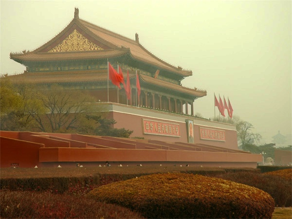

Fattal color line

He et al.

Ren et al.

### toys

Original

Our method
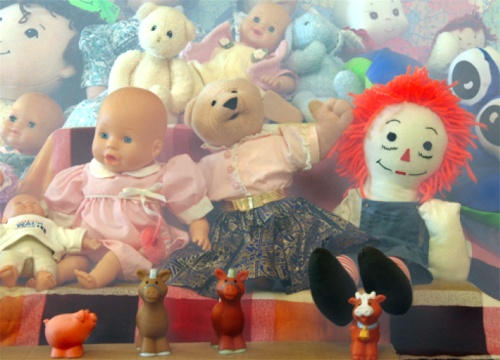

Fattal color line

He et al.

### train

Original

Our method
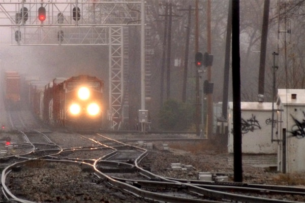

Fattal color line

He et al.

Ren et al.

### tree

Original

Our method

Fattal color line

Ren et al.

### y01

Original

Our method

Fattal color line

Ren et al.

### y16

Original

Our method
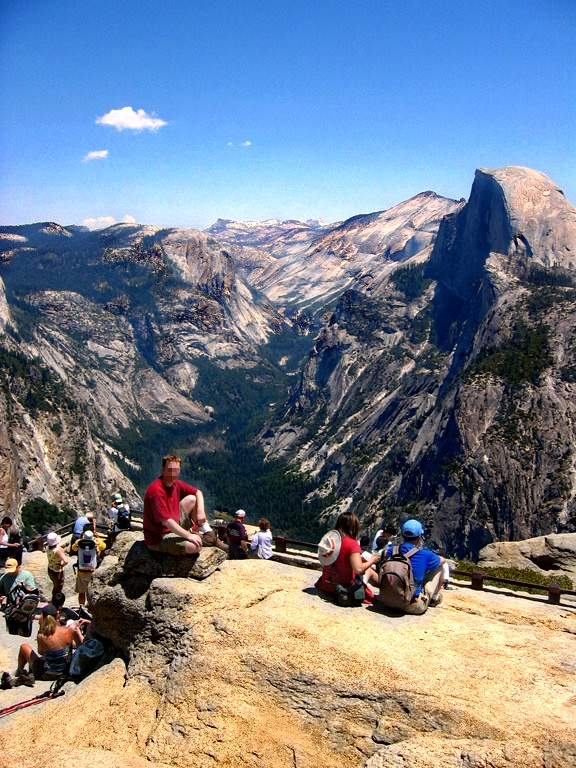

Fattal color line

Ren et al.

### yellowmountain

Original

Our method

Fattal color line

He et al.

Ren et al.

