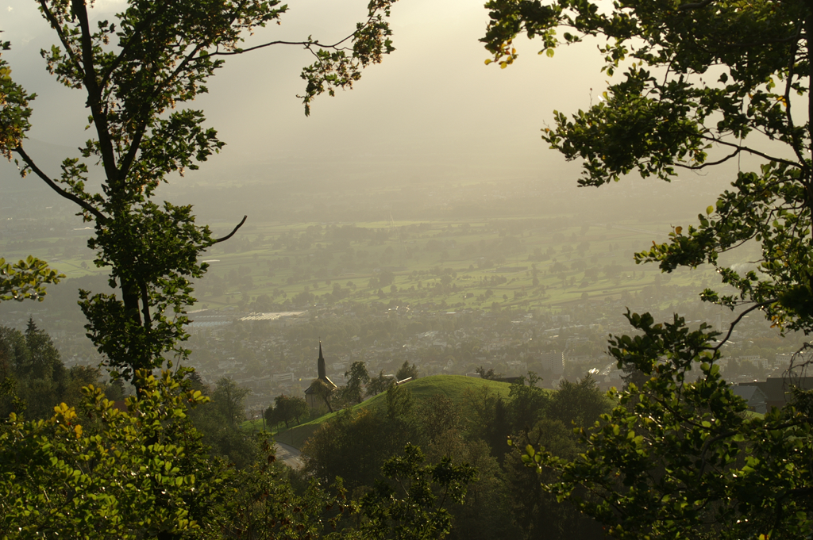
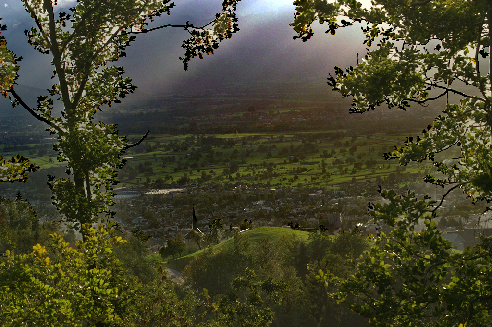

## Single Image Dehazing with Varying Atmospheric Light Intensity

#### Sanchayan Santra, Bhabatosh Chanda

   

   
   

   

   
   

<b>Abstract</b>

Images taken in bad weather conditions like haze and fog suffer from loss of contrast and color shift. The object radiance is attenuated in the atmosphere and the atmospheric light is added to the scene radiance creating a veil like semi-transparent layer called airlight. The methods proposed till now assumes that the atmospheric light is constant throughout the image domain, which may not be true always. Here we propose a method that works under the relaxed assumption that the color of atmospheric light is constant but its intensity may vary in the image. We use the color line model to estimate the contribution of airlight in each patch and interpolate at places where the estimate is not reliable. We apply reverse operation to recover the haze free image.

Published in [NCVPRIPG 2015](http://ieeexplore.ieee.org/document/7490015/)  
Preprint paper: [[pdf]](santra_dehaze_varlight.pdf)  
Presentation slide: [[pdf]](slide_ncvpripg15.pdf)

**Results:** [Output Comparison](results.html)

Original image - <a href="http://commons.wikimedia.org/wiki/File:Oberfallenberg4.JPG">"Oberfallenberg4"</a> by böhringer friedrich. License CC BY-SA 2.5, Wikimedia Commons.